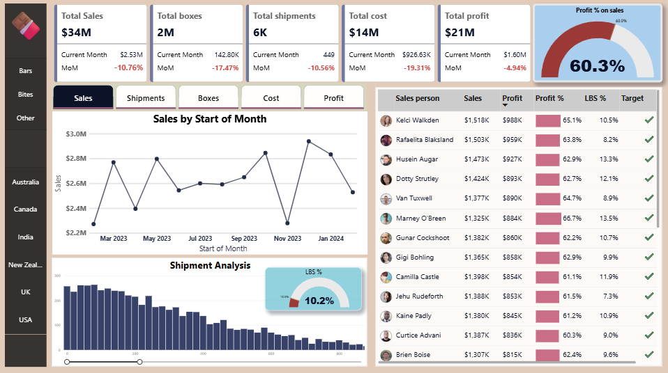

# Chocolate Sales Analysis Dashboard

This Power BI dashboard provides a detailed analysis of chocolate sales, shipments, profit margins, product performance, and salesperson insights across multiple regions.
It helps identify sales trends, top products, regional patterns, and profitability metrics for decision-making.

---

## 🎯 1. Objective

The goal of this dashboard is to convert raw sales data into meaningful business insights, such as:

- Regional performance analysis

- Profitability trends

- Product category insights

- Yearly/monthly sales patterns

- Sales contribution by region and product

---

## 2. Files Included
| File Name | Description |
|------------|-------------|
| `Sales_Analysis_Dashboard.pbix` | Power BI dashboard file |
| `sample-data.xlsx` | Dataset used for analysis |
| `Dashboard_Screenshot.png` | Screenshot of the final dashboard |

---

## Tools & Technologies Used
- Power BI  
- Microsoft Excel  

---

## 3. Dashboard Preview

---

## 4. Business Questions Answered
### Sales Performance

- What are the total sales, total boxes sold, and total shipments?

- How has sales changed month-over-month?

- What is the overall profit percentage?

### Trend Analysis

- How do sales vary month-by-month?

- What is the shipment volume trend?

### Profitability

- What is the monthly profit trend?

- Which salespeople contribute the most profit?

### Salesperson Insights

- Who are the top salespeople by sales and profit?

- What is their profit %, LBS %, and target achievement?

- Who met their sales target?

### Product Performance (Bookmarked Page)

- Which products generate the highest revenue and profit?

- Which products underperform?

- Which product categories are the most profitable?

- What are the sales trends for each product group?

5. Key Insights & Findings
⭐ Sales & Region Insights

- Americas, UK, and Australia generate the highest sales.

- Profit percentage remains above 60%, indicating efficient operations.

⭐ Salesperson Insights

- Top performers like Kelci Walkden and Rafaelia Blaksland consistently meet targets.

- Profit % ranges between 61%–65%.

⭐ Product Insights

- Bars & Bites dominate sales and profit.

- A few SKUs underperform and may need menu/stock optimization.

- High-value products significantly improve overall profit%

---

## 6. Conclusion

This dashboard provides comprehensive insights into:

- Sales patterns

- Regional performance

- Salesperson contributions

- Product-level performance

- Shipment behavior

- Profit drivers

These insights support decisions related to:

- Product strategy

- Regional targeting

- Sales planning

- Cost optimization

- Inventory and logistics

