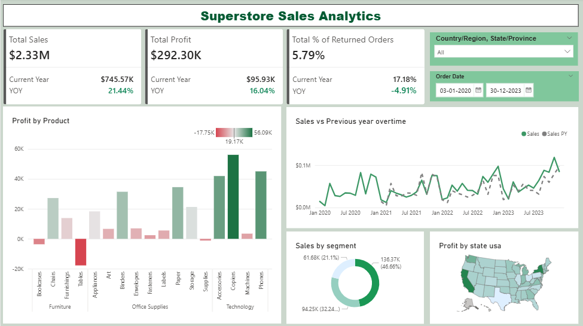

# Superstore Sales Analytics

## Project Overview

This Power BI dashboard provides clear insights into **sales performance**, **profit margins**, and **regional trends**.
It helps identify top-performing regions, product categories, and sales patterns to support **data-driven business decisions**.

---

##  Files Included

| File Name                  | Description                       |
| -------------------------- | --------------------------------- |
| `Superstore_Sales.pbix`    | Power BI dashboard file           |
| `sample-data.xlsx`         | Dataset used for analysis         |
| `Dashboard_Screenshot.png` | Screenshot of the final dashboard |

---

##  Tools & Technologies Used

* **Power BI**
* **Microsoft Excel**
* (Optional) Power Query / DAX

---

##  Dashboard Preview

---

##  Key Insights

* The **Americas region** recorded the highest sales.
* Top-performing product categories highlight strong opportunities for forecasting.
* Profitability varies significantly across product segments and regions.
* Visual trends help spot seasonality and customer purchase patterns.

---
